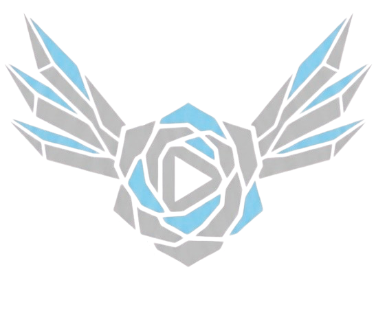

<p align="center">
  
</p>

<h1 align="center">FrozenMusic</h1>

<p align="center">
  <b>Download full playlists and albums from YouTube Music and play them offline, in a player that looks and feels like YouTube Music itself.</b>
</p>

<p align="center">
  <a href="https://fr0z3n.com">Website</a> ·
  <a href="https://github.com/xFr0z3n/YTMusicUltimate/actions">Build</a> ·
  <a href="#credits">Credits</a>
</p>

---

## Features

### Downloads
- **Full playlists and albums** in one tap: one folder per playlist, track numbers follow the playlist order, songs that are already downloaded are skipped, and the numbering is updated when the playlist order changes
- **Single songs** as `.m4a` (original quality, no re-encoding) or `.mp3` (LAME)
- **Complete tags**: title, artist, album, album artist, track number, embedded cover art, plus `cover.png`, creator and description for every playlist

### Offline player
- Mini player and full player with the cover's color hue
- Queue with reordering, Play next, Add to queue, shuffle and repeat
- Lock screen and Control Center controls that never interfere with YouTube Music's own player

### Downloads tab
- Built to match YouTube Music: Library-style chips for Playlists, Songs, Albums, Artists and Creators
- Artist and creator pages, search, listening history and editable playlist order
- YouTube Music-style menus: Go to album, Go to artist, Share, Open folder and more

### Discord Rich Presence
- Shows what you're listening to as your Discord status: song, artist, a live progress bar and the cover art
- Set it up right in the app under **YTMusicUltimate → FrozenMusic → Discord RPC**, with a step-by-step guide on the page, or build it into your IPA with repository secrets (see [Discord RPC setup](#discord-rpc-setup))
- Cover art is uploaded to your own WebDAV storage (Nextcloud works out of the box); without it the status works without the cover

### Extras
- **Volume Boost** up to 2000% (swipe on the middle of the right edge, or shake)
- Everything from YTMusicUltimate: background playback, no ads, premium features, OLED Dark Theme and more

### FrozenMusic settings
Found under **YTMusicUltimate → FrozenMusic**:

| Option | Default | What it does |
|---|---|---|
| Original YTM album look | Off | Album pages show track numbers instead of cover art |
| Player hue with OLED | Off | Keeps the cover hue in the full player with OLED Dark Theme |
| YTM volume boost look | Off | Volume Boost panel in YouTube Music's style: grey, or black with OLED Dark Theme, with a white slider |
| Snappy | Off | Everything in the Downloads tab opens and closes instantly, without animations |

The **Discord RPC** page is at the top of the FrozenMusic settings.

## Installation

FrozenMusic is built as a sideloadable IPA with GitHub Actions.

1. Fork this repository.
2. In your fork, open **Settings → Actions → General** and enable **Read and write permissions**.
3. Open the **Actions** tab, select **Build and Release YTMusicUltimate** and click **Run workflow**.
4. Paste a direct link to a **decrypted** YouTube Music `.ipa` (it can't be provided here for legal reasons) and start the build.
5. When the build finishes, download the IPA from the **Releases** page of your fork (`github.com/<your-username>/YTMusicUltimate/releases`) and sideload it.

**Troubleshooting:** almost every failed build comes from the IPA link. It has to be a direct download of a decrypted `.ipa` file.

### Building locally

With [Theos](https://theos.dev/docs/installation) installed:

```sh
make clean package SIDELOADING=1   # for injecting into an IPA
make clean package ROOTLESS=1      # rootless jailbreak
make clean package                 # rootful jailbreak
```

## Discord RPC setup

You need two things from Discord, and optionally a WebDAV folder for cover art.

1. **Application ID:** open the [Discord Developer Portal](https://discord.com/developers/applications), click **New Application**, give it a name (for example *YouTube Music*) and create it. Copy the **Application ID** from *General Information*. Nothing else has to be set up there.
2. **Token:** your Discord account token; the status is set from your account the same way the desktop app does it. Keep it private: anyone who has it can log into your account. Discord doesn't officially support using your account token like this, so use it at your own risk.
3. **Cover art (optional):** FrozenMusic uploads the cover to your WebDAV storage and Discord loads it from a public link. With [Nextcloud](https://nextcloud.com/sign-up/):
   - create a folder, for example `discord-art`, and share it with a **public share link** (`https://cloud.example.com/s/AbC123`)
   - the **WebDAV folder URL** is `https://cloud.example.com/remote.php/dav/files/USERNAME/discord-art/` (shown under *Files → Files settings*)
   - create an **app password** under *Settings → Security → Devices & sessions*

Then pick one of two ways:

- **In the app:** *YTMusicUltimate → FrozenMusic → Discord RPC*, fill in the fields and tap ✓ at the top right to restart YouTube Music.
- **Build secrets:** in your fork go to *Settings → Secrets and variables → Actions* and add `DISCORD_APP_ID`, `DISCORD_TOKEN` and, for cover art, `NEXTCLOUD_WEBDAV_URL`, `NEXTCLOUD_USER`, `NEXTCLOUD_PASS`, `NEXTCLOUD_PUBLIC_URL`. Every IPA you build afterwards has them built in.

Anything set in the app is used instead of the matching build secret.

## Credits

### Based on
- **[YTMusicUltimate](https://github.com/dayanch96/YTMusicUltimate)** by dayanch96, the base of FrozenMusic: all original features and hooks, the settings, the Downloads tab structure, and the original single-song download logic (HLS manifest → audio stream → ffmpeg without re-encoding).

### Inspiration & logic reference
- **[youtube_music_playlist_downloader](https://github.com/ColoradoCrusade/youtube_music_playlist_downloader)** (ColoradoCrusade fork), the logic template for the playlist downloader: one folder per playlist, track number = playlist position, album = playlist name, skipping songs that are already downloaded, renumbering when the playlist order changes, and embedded covers. FrozenMusic additionally writes the playlist name as album artist, which the script didn't.
- **[yt-dlp](https://github.com/yt-dlp/yt-dlp)**, reference for YouTube's InnerTube clients and stream formats while testing a direct-download route. YouTube blocks that route, so none of it ships.

### Volume boost
- **[VolumeBoostYT](https://github.com/irum0320/VolumeBoostYT)** by irum0320, the original volume boost tweak.
- **[VolumeBoostYT](https://github.com/candyzp/VolumeBoostYT)** (candyzp fork), which replaced the original touch handling that broke the seek slider with a proper gesture recognizer, and added the volume panel.
- **[VolumeBoostYT](https://github.com/xFr0z3n/VolumeBoostYT)** (FrozenMusic fork): tap the upper part of the volume panel to reset to 100%, touches on seek bars are ignored so the slider always works, and it also loads in YouTube Music. Bundled in FrozenMusic with an optional YouTube Music look.

### Third-party components
- **[mobile-ffmpeg](https://github.com/tanersener/mobile-ffmpeg)** (already bundled in YTMusicUltimate): downloads audio and writes m4a tags.
- **[MBProgressHUD](https://github.com/jdg/MBProgressHUD)** (already bundled in YTMusicUltimate): progress and status popups.
- **[LAME](https://lame.sourceforge.io/)** 3.100: MP3 encoder, compiled from the [official source](https://sourceforge.net/projects/lame/files/lame/3.100/) during the GitHub Actions build. LAME is licensed under the [GNU LGPL](https://www.gnu.org/licenses/old-licenses/lgpl-2.0.html); its source code is available at the links above.

### Research references (no code used)
- **[MaxMusic](https://github.com/Mark02-2012/MaxMusic)**, analyzed only: its build is a closed prebuilt `.deb`, which was unpacked to find out why downloads crashed. The lookup of the player data broke in newer YouTube Music versions; the fix in FrozenMusic was written independently and no code was taken.

### Written for FrozenMusic
- Playlist & album download via capture mode (the app's own player loads each song, the stream is captured and the player skips ahead), with title matching and a stall watchdog
- `.m4a` (original quality) and `.mp3` (LAME) export with full tags, embedded covers, `cover.png`, creator and description
- Custom ID3v2.3 writer for mp3 and m4a cover embedding
- YouTube Music-style Downloads tab with its own offline player (queue, shuffle, repeat, lock screen controls)
- Discord Rich Presence, with in-app setup and cover art via WebDAV

---

<p align="center"><sub>FrozenMusic by <a href="https://fr0z3n.com">Fr0z3n</a>. Not affiliated with Google or YouTube. YouTube Music is a trademark of Google LLC.</sub></p>
