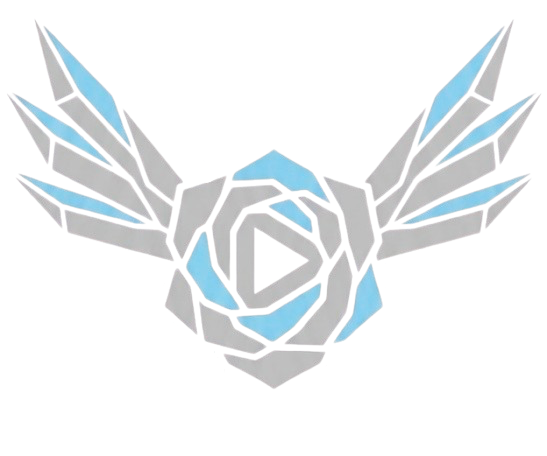

<p align="center">
  
</p>

<h1 align="center">FrozenMusic</h1>

<p align="center">
  An iOS tweak for YouTube Music that downloads playlists, albums and songs for offline listening, with a player built to match the original app.
</p>

<p align="center">
  <a href="https://fr0z3n.com">Website</a> ·
  <a href="#installation">Installation</a> ·
  <a href="#credits">Credits</a>
</p>

---

## Features

### Downloads
- Playlists and albums in a single step, saved to one folder each with track numbers matching the playlist order
- Updating a playlist or album keeps the folder identical to the current list: new songs are downloaded, moved songs are renumbered, removed songs are deleted, changed titles, artists and album names are written to the tags, and all lyrics are checked again. Songs that are no longer playable are skipped, and a renamed playlist keeps its folder
- Names are kept exactly as on YouTube Music, including characters such as `/` or `:` (stored as look-alike characters in file names)
- Songs are saved while the player moves on to the next one, with cover art and MP3 conversion processed alongside; lyrics are fetched once every song has been saved
- Progress is shown step by step (checking songs, downloading, lyrics, cover and info). The download and lyrics steps can be skipped, and a download can be stopped at any time
- Single songs as `.m4a` (original stream, no re-encoding) or `.mp3` (LAME, ~190 kbps)
- Full metadata: title, artist, album, album artist, track number and embedded cover art, plus `cover.png`, creator and description for each playlist or album

### Lyrics
- Downloaded with every song and stored as `.lrc` files in a `Lyrics` folder next to the audio files. Songs without lyrics are recorded as such, so the lyrics screen opens instantly
- Time-synced lyrics from YouTube Music, cross-checked with [LRCLIB](https://lrclib.net), which also serves as a fallback
- Lyrics already saved for the same song in another playlist or album are reused, and lyrics without timing are replaced as soon as a synced version is found
- Lyrics screen modeled on YouTube Music's: blurred cover background, current line highlighted, tap a line to seek
- Share selected lines as text
- Translation through Google when online and on-device ML Kit models when offline; languages are managed under **FrozenMusic → Offline translation**

### Offline player
- Mini player and full-screen player with colors taken from the cover art
- Queue with reordering, Play next, Add to queue, shuffle and repeat
- Lock screen and Control Center controls that do not interfere with YouTube Music's own playback

### Downloads tab
- Library layout with Playlists, Songs, Albums, Artists and Creators
- Artist and creator pages, search, listening history and an editable playlist order
- Context menus for Go to album, Go to artist, Share, Open folder and more

### Discord Rich Presence
- Displays the current song, artist, progress and cover art as your Discord status
- Configured in the app under **FrozenMusic → Discord RPC** or through build secrets (see [Discord RPC setup](#discord-rpc-setup))
- Cover art is uploaded to a WebDAV server of your choice, such as Nextcloud; without one, the status is shown without artwork

### Additional features
- Volume boost up to 2000%, opened by swiping on the right edge of the screen or by shaking the device
- All YTMusicUltimate features, including background playback, ad removal, premium features and the OLED dark theme

## Settings

The following options are available under **YTMusicUltimate → FrozenMusic**. All of them are off by default.

| Option | Description |
|---|---|
| Original YTM album look | Album pages show track numbers instead of cover art |
| Player hue with OLED | Keeps the cover-based colors in the full-screen player when the OLED dark theme is enabled |
| YTM volume boost look | Displays the volume boost panel in YouTube Music's style |
| Snappy | Disables animations in the Downloads tab |

The same page contains the **Discord RPC** and **Offline translation** settings.

## Installation

FrozenMusic is distributed as a sideloadable IPA built with GitHub Actions.

1. Fork this repository.
2. In the fork, go to **Settings → Actions → General** and enable **Read and write permissions**.
3. Open the **Actions** tab, select **Build and Release YTMusicUltimate** and click **Run workflow**.
4. Enter a direct download link to a decrypted YouTube Music `.ipa` and start the build. The IPA cannot be provided here for legal reasons.
5. Once the build has finished, download the IPA from the **Releases** page of the fork and sideload it.

Most failed builds are caused by the IPA link. It must point directly to a decrypted `.ipa` file.

### Building locally

With [Theos](https://theos.dev/docs/installation) installed:

```sh
make clean package SIDELOADING=1   # for injection into an IPA
make clean package ROOTLESS=1      # rootless jailbreak
make clean package                 # rootful jailbreak
```

Offline translation is built separately by the GitHub Actions workflow and is only included in IPA builds.

## Discord RPC setup

Rich Presence requires a Discord application ID and your Discord token. A WebDAV folder for cover art is optional.

1. **Application ID:** in the [Discord Developer Portal](https://discord.com/developers/applications), create a new application and give it a name, for example *YouTube Music*. Copy the **Application ID** from *General Information*. No further configuration is needed.
2. **Token:** your Discord account token. The status is set from your account in the same way the desktop client does it. Keep the token private, as it grants full access to your account. Discord does not officially support this use of account tokens.
3. **Cover art (optional):** FrozenMusic uploads the cover to a WebDAV folder, and Discord loads it through a public link. With [Nextcloud](https://nextcloud.com/sign-up/):
   - create a folder such as `discord-art` and share it through a **public link** (`https://cloud.example.com/s/AbC123`)
   - the **WebDAV folder URL** is `https://cloud.example.com/remote.php/dav/files/USERNAME/discord-art/`, shown under *Files → Files settings*
   - create an **app password** under *Settings → Security → Devices & sessions*

The values can be entered in either of two places:

- **In the app:** under **FrozenMusic → Discord RPC**. Tap ✓ to save and restart YouTube Music.
- **As build secrets:** in the fork under *Settings → Secrets and variables → Actions*, add `DISCORD_APP_ID`, `DISCORD_TOKEN` and, for cover art, `NEXTCLOUD_WEBDAV_URL`, `NEXTCLOUD_USER`, `NEXTCLOUD_PASS` and `NEXTCLOUD_PUBLIC_URL`. They are included in every IPA built afterwards.

Values entered in the app take precedence over build secrets.

## Credits

### Base
- **[YTMusicUltimate](https://github.com/dayanch96/YTMusicUltimate)** by dayanch96: the foundation of FrozenMusic, including its features and hooks, the settings, the Downloads tab structure and the original single-song download.

### References
- **[youtube_music_playlist_downloader](https://github.com/ColoradoCrusade/youtube_music_playlist_downloader)** (ColoradoCrusade fork): the model for the playlist downloader's folder structure, track numbering, skipping of existing songs, renumbering and embedded covers.
- **[yt-dlp](https://github.com/yt-dlp/yt-dlp)**: reference for YouTube's InnerTube clients and stream formats. No code is used.
- **[MaxMusic](https://github.com/Mark02-2012/MaxMusic)**: its prebuilt package was examined to diagnose a download crash in newer YouTube Music versions. The fix was written independently and no code is used.

### Volume boost
- **[VolumeBoostYT](https://github.com/irum0320/VolumeBoostYT)** by irum0320: the original tweak.
- **[VolumeBoostYT](https://github.com/candyzp/VolumeBoostYT)** (candyzp fork): gesture recognizer that fixed seek bar interference, and the volume panel.
- **[VolumeBoostYT](https://github.com/xFr0z3n/VolumeBoostYT)** (FrozenMusic fork): reset to 100%, seek bar handling and YouTube Music support.

### Third-party components
- **[LRCLIB](https://lrclib.net)**: lyrics database.
- **[ML Kit Translation](https://developers.google.com/ml-kit/language/translation)** by Google: on-device translation, subject to the [ML Kit terms](https://developers.google.com/ml-kit/terms).
- **[mobile-ffmpeg](https://github.com/tanersener/mobile-ffmpeg)**: audio download and m4a tagging.
- **[MBProgressHUD](https://github.com/jdg/MBProgressHUD)**: progress indicators.
- **[LAME](https://lame.sourceforge.io/)** 3.100: MP3 encoding, compiled from the [official source](https://sourceforge.net/projects/lame/files/lame/3.100/) during the build and licensed under the [GNU LGPL](https://www.gnu.org/licenses/old-licenses/lgpl-2.0.html).

---

<p align="center"><sub>FrozenMusic by <a href="https://fr0z3n.com">Fr0z3n</a>. Not affiliated with Google or YouTube. YouTube Music is a trademark of Google LLC.</sub></p>
